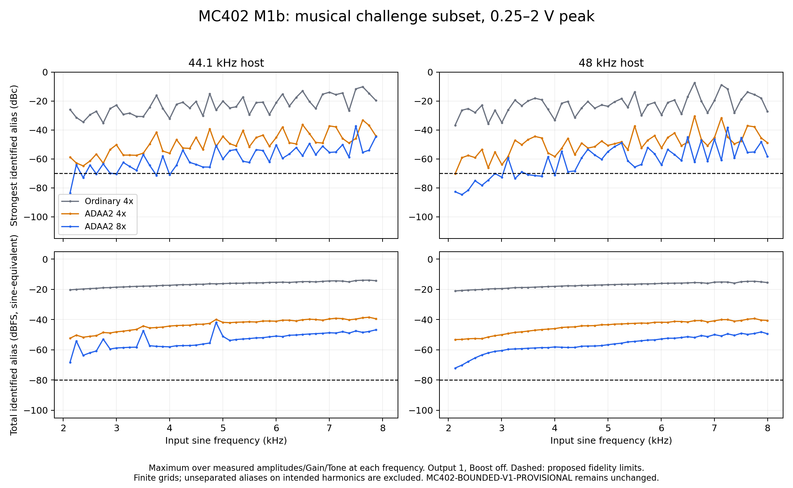

> **Historical Overdrive research — rejected for product integration.** The accepted
> M1c review ended development of these provisional nonlinear profiles: insufficient
> evidence plus failure of the approved fidelity envelope even with ideal resampling.
> Overdrive is deferred pending stronger circuit evidence or hardware measurement.
> Current product scope is [MC402-CLEAN-BOOST-V1](../../clean-boost-v1/README.md);
> rejected source and reproduction guidance are in the [archive](../../rejected-overdrive/README.md).
> References below to production, integration blockers or M2 status describe the
> historical milestone only. Its measurements do not describe the new clean Boost.

# MC402 M1b: product fidelity and torture robustness

2026-09-11. Frozen DSP: **MC402-BOUNDED-V1-PROVISIONAL**.
Envelope: **MC402-M1B-PRODUCT-ENVELOPE-PROPOSAL-1**, proposed for review.

**Decision C: neither ADAA2 4x nor ADAA2 8x qualifies. Return the provisional
saturation/topology and its antialias realization to design review.** This
conclusion follows from product cases at 0.25–2 V, including failures at 0.5 V;
it does not depend on retaining 10 V/near-Nyquist torture as a fidelity gate.
Both candidates fail the original -70 dBc criterion alone. The newly proposed
absolute criterion is not what forces this decision.

No static transfer, H1/H2, Gain/Tone/Output law, filter coefficient, topology,
production DSP, NAM integration, UI, TC BLD or Yamaha file was changed. The
M1a ordinary/ADAA experiment is imported unchanged. No solution is selected
for production, no M2 work is started, and no commit is made. Gain-zero mute
remains a regression of the named provisional profile, not a verified MC402 fact.

**Subsequent review:** the user accepted this M1b result and authorized only
a local knee redesign experiment. [M1c](../m1c/README.md) evaluates the separate
offline R2 profile against this same PRODUCT domain and both unchanged gates.
The C² candidate also fails with ideal resampling; M1c decision D keeps the
broader provisional model in review. This M1b report and its V1 numerical
artifacts remain the historical record; no production solution or M2 is approved.

## Proposed PRODUCT envelope and its physical basis

The full reasoning and preregistered criteria are in [protocol.md](protocol.md);
the PRODUCT grid and criteria are collected in [envelope.json](envelope.json).

| Property | Proposal |
| --- | --- |
| Maximum pedal input | **4.5 V peak**, measured after mono preparation, calibration bridge and input trim |
| Single-tone frequency domain | **40 Hz–10 kHz**; analyze output aliases over **20 Hz–20 kHz** |
| Musical challenge subset | **0.25–2 V peak, 2–8 kHz**, including high Gain and both Tone extremes |
| Controls in scope | Full normalized Gain/Tone/Output ranges; finite grids below, mute endpoints and scalar-law checks |
| Qualification output reference | Output **1**, Boost **off**; attenuation or downstream Boost cannot earn qualification |

Passive pickup ratings are typically expressed at a manufacturer-specific test
condition. DiMarzio calls its mV figures relative loudness indicators; they are
not hard peak limits. Active-pickup documentation gives larger voltage figures,
but does not consistently identify RMS versus peak versus peak-to-peak. Hence
2 V cannot be asserted as a conservative maximum for every active guitar.
The 4.5 V bound is an engineering allowance for hot nominal-9-V instrument
outputs, **not a newly established hardware MC402 input rating**. Neither
the supply nor H=2.5 V is a valid universal input-clipping ceiling.

The nominal 9 V context makes 10 V peak / 20 V peak-to-peak an appropriate
out-of-scope overload challenge for this bounded model. It does not make the
model hardware accurate up to 4.5 V. Higher-voltage onboard systems, external
boosters and excessive input trim can exceed the declared product domain.
Sources and their measurement ambiguities are explicitly listed in the protocol.

The frequency rectangle is conservative: a real pluck distributes its peak
among partials, whereas this test permits the whole peak at each frequency.
Manufacturer pickup resonances extending through several kHz and above 8 kHz
do not support inventing a sharp 8 kHz cutoff or a favorable spectral taper.
10 kHz is a guard band around the existing 8 kHz response target, and 40 Hz
allows low tunings. Content above 10 kHz is not asserted absent: low-level
10–20 kHz tail sensitivity is reported separately. The rectangle is a declared
fidelity test domain, not a statistical description of every guitar recording.

The unchanged voltage bridge is
`v = mono * 10^(trimDb/20) * sqrt(2)*0.775*10^(C_host/20)` when calibration is
active; fallback uses one post-trim unit per **provisional** volt. Model
calibration belongs after the pedal. At a hypothetical verified +12 dBu
interface calibration with zero trim, full scale is **4.363316339 V peak**:

| Pedal peak | Host normalized peak | Host peak dBFS |
| ---: | ---: | ---: |
| 0.25 V | 0.057295869 | -24.837534 |
| 0.5 V | 0.114591737 | -18.816934 |
| 2 V | 0.458366949 | -6.775734 |
| 4.5 V | 1.031325636 | +0.267916 |

These are conversion examples, not a claim that the interface is calibrated
to +12 dBu. The 4.5 V case would require suitable interface headroom or trim;
fallback and calibrated paths must not be confused. No input clamping or new
prefilter was added to enforce the envelope.

## Exact proposed qualification rule and measurement

Require both, for each nonmuted PRODUCT point at canonical Output/Boost:

1. Strongest identified in-band alias **<= -70 dBc** relative to the fundamental.
2. Total identified in-band alias power **<= -80 dBFS sine-equivalent**.

The second is a proposed engineering budget: **70.7107 microvolts RMS total**,
equivalent to **100 microvolts peak** for one sine. It bounds every individual
alias at -80 dBFS or lower. It is not a hardware noise specification or a claim
about audibility through NAM. It corresponds to the original relative budget
at a -10 dBFS fundamental and was fixed before the sweep. There is no relaxed
dBc exception for dark Tone, quiet Gain or low Output. Both numbers remain visible.

Absolute dBFS retains M1a's convention: 0 dBFS is **1 provisional V peak** for
a sinusoid. For peak Fourier coefficients C, total alias RMS volts is
`sqrt(sum(abs(C_alias)^2)/2)`; total sine-equivalent dBFS is
`10*log10(sum(abs(C_alias)^2))`. Total alias dBc uses fundamental RMS as reference.
Values above 0 dBFS are valid internal floating-point levels.

Coherent odd-bin sines use an **8192-sample rectangular FFT**, with at least
0.5 s of whole-period warmup. Duplicate low-frequency bins at high rates are
removed. Grid: 37 requested frequencies, including 250 Hz spacing through
2–8 kHz; 13 amplitudes from 5 mV to 4.5 V; Gain 0.1/0.25/0.5/0.75/0.9/1;
Tone 0/0.5/1. A prescribed follow-up uses **125 Hz spacing**, nine amplitudes
from 0.25 to 2 V, seven Gain values 0.5–1, and Tone 0/1. Shared cases are reused.
Coherent frequencies are recorded exactly; they can lie just above/below a
requested subset endpoint, and subset summaries use actual frequencies.

Lower Gain is not excluded to obtain a pass. With settled Gain <=0.25, the
bounded S1 output and stable coupling filter imply
`abs(S2 input) <= abs(A2)*2*H1*0.25^exponent = 1.068182 V`, below S2's
2.25 V knee. This region therefore scales linearly with the Gain attenuation;
its relative aliases are unchanged by reducing Gain. Additional renders at
Gain 0.001/0.01/0.05/0.1/0.25 verify this relation. Gain zero and Output zero
are exactly silent in these settled/reset experiments; dynamic transition
behavior remains covered by the unchanged M1 production tests.

The continuous-time periodic reference from M1a has zero energy at identified
nonharmonic bins. All grid alias measurements compare with those zero reference
coefficients. Intended unfolded harmonics are excluded. Aliases landing on an
intended harmonic remain unseparated, so total energy is a **lower bound**.
Full continuous-time harmonic comparisons on worst and representative cases,
quadrature convergence, longer records and phase checks are retained separately.
Aligned full-band residual includes dynamic ADAA/BLT differences and is not
mislabelled as alias energy. A failed finite-grid point establishes failure;
a finite-grid pass would not prove all arbitrary guitar waveforms qualified.

## Measured PRODUCT results

<!-- BEGIN RESULTS -->
**241,164 distinct PRODUCT renders** across all six rates and three methods, including the dense follow-up.

| Host Hz | Method | Worst alias dBc | Strongest alias dBFS | Maximum total alias dBFS | Relative failures / cases |
| ---: | --- | ---: | ---: | ---: | ---: |
| 44100 | ordinary4 | -10.158 | -16.535 | -13.100 | 10451 / 13632 |
| 44100 | adaa2_4 | -33.162 | -37.461 | -37.061 | 6076 / 13632 |
| 44100 | adaa2_8 | -33.991 | -41.988 | -41.872 | 3491 / 13632 |
| 48000 | ordinary4 | -7.304 | -15.828 | -13.413 | 10405 / 13632 |
| 48000 | adaa2_4 | -30.422 | -38.531 | -37.283 | 5494 / 13632 |
| 48000 | adaa2_8 | -34.112 | -44.862 | -44.094 | 2419 / 13632 |
| 88200 | ordinary4 | -10.094 | -21.384 | -18.830 | 9576 / 13398 |
| 88200 | adaa2_4 | -32.413 | -43.617 | -42.614 | 2818 / 13398 |
| 88200 | adaa2_8 | -41.085 | -50.654 | -50.058 | 630 / 13398 |
| 96000 | ordinary4 | -13.869 | -23.198 | -19.853 | 9387 / 13398 |
| 96000 | adaa2_4 | -36.321 | -44.952 | -44.146 | 2405 / 13398 |
| 96000 | adaa2_8 | -46.224 | -51.415 | -50.923 | 390 / 13398 |
| 176400 | ordinary4 | -15.630 | -27.313 | -24.860 | 7996 / 13164 |
| 176400 | adaa2_4 | -39.606 | -50.473 | -49.947 | 667 / 13164 |
| 176400 | adaa2_8 | -58.544 | -63.216 | -61.823 | 39 / 13164 |
| 192000 | ordinary4 | -16.834 | -27.754 | -25.549 | 7551 / 13164 |
| 192000 | adaa2_4 | -41.865 | -51.519 | -50.715 | 413 / 13164 |
| 192000 | adaa2_8 | -60.359 | -66.056 | -64.254 | 16 / 13164 |

The three maxima in each row may occur at different settings. Complete coordinates,
fundamental/alias levels and aggregate energy are in [worst-cases.md](worst-cases.md)
and [summary.json](summary.json). Every rate/method fails the original relative
gate. The absolute/aggregate gate also fails; neither is relaxed.

Global relative winners for the two ADAA candidates:

| Method | Host Hz | Input Hz | V peak | Gain | Tone | Fundamental dBFS | Alias Hz | Alias dBFS | dBc |
| --- | ---: | ---: | ---: | ---: | ---: | ---: | ---: | ---: | ---: |
| adaa2_4 | 48000 | 6626.953125000 | 2 | 0.5 | 0 | -12.520725 | 181.640625000 | -42.942399 | -30.421674 |
| adaa2_8 | 44100 | 7498.937988281 | 4.5 | 0.5 | 0 | -13.523190 | 349.914550781 | -47.514683 | -33.991493 |

Restricting the peak to 2 V and frequency to 2–8 kHz still gives:

| Host Hz | Ordinary 4x worst dBc | ADAA2 4x worst dBc | ADAA2 8x worst dBc |
| ---: | ---: | ---: | ---: |
| 44100 | -10.158 | -33.162 | -37.296 |
| 48000 | -7.304 | -30.422 | -38.201 |
| 88200 | -10.114 | -35.708 | -56.383 |
| 96000 | -13.893 | -40.394 | -54.209 |
| 176400 | -17.772 | -50.841 | -70.048 |
| 192000 | -16.919 | -49.991 | -76.199 |

The independent continuous-time reference is checked on **134 selected cases**, including relative/absolute winners and the 1 kHz/5 kHz examples. Doubling quadrature order gives a worst coefficient difference of **-297.10 dB** relative to reference energy; this is a numerical convergence check, not physical accuracy. The 18 musical winners are checked at 8192/32768 samples and three phases. Maximum same-phase record-length change is **2.21e-10 dB**, and maximum phase/length spread is **1.21e-05 dB**. No detector-error explanation rescues the failures.


<!-- END RESULTS -->

## Revisited 5 kHz case and distinct failure causes

Both global relative winners use **Gain 0.5**, not the maximum Gain endpoint.
Gain 1 also has material failures. Intermediate Gain coverage is essential for
this coupled two-stage profile; a full-Gain-only sweep would miss the winners.
At 176.4/192 kHz, 8x passes the relative rule on the measured 0.25–2 V / 2–8 kHz
subset, but 10/1 cases respectively exceed the proposed aggregate absolute
budget. Both rates still fail -70 dBc in the full proposed PRODUCT domain.

The final measurements below distinguish the approximately 5 kHz / 0.5 V /
Gain 1 case from its neighborhood. It is not safe to qualify an algorithm from
one frequency/rate pair: folds can move across the analysis band or a FIR
transition, and near-rational rate/frequency relationships can change the result.

<!-- BEGIN FIVE_K -->
All rows: 0.5 V peak, Gain 1, Output 1. Each cell is **alias dBc / alias dBFS**.

| Host Hz | Actual input Hz | Tone | Ordinary 4x | ADAA2 4x | ADAA2 8x |
| ---: | ---: | ---: | ---: | ---: | ---: |
| 44100 | 5001.086426 | 0 | -20.285 / -30.296 | -54.836 / -64.873 | -67.416 / -77.416 |
| 44100 | 5001.086426 | 1 | -29.798 / -21.164 | -63.225 / -54.616 | -62.348 / -53.727 |
| 48000 | 4998.046875 | 0 | -24.637 / -34.639 | -66.770 / -76.793 | -101.350 / -111.342 |
| 48000 | 4998.046875 | 1 | -31.207 / -22.573 | -68.523 / -59.910 | -97.248 / -88.625 |
| 88200 | 5006.469727 | 0 | -28.182 / -38.186 | -100.300 / -110.309 | -114.246 / -124.246 |
| 88200 | 5006.469727 | 1 | -36.951 / -28.327 | -95.653 / -87.035 | -115.853 / -107.233 |
| 96000 | 5003.906250 | 0 | -27.646 / -37.644 | -102.275 / -112.278 | -117.674 / -127.669 |
| 96000 | 5003.906250 | 1 | -37.479 / -28.854 | -97.520 / -88.900 | -121.520 / -112.898 |
| 176400 | 5017.236328 | 0 | -38.313 / -48.330 | -115.618 / -125.637 | -107.153 / -117.170 |
| 176400 | 5017.236328 | 1 | -45.585 / -36.968 | -116.781 / -108.165 | -120.344 / -111.727 |
| 192000 | 4992.187500 | 0 | -46.782 / -56.756 | -126.080 / -136.055 | -117.599 / -127.573 |
| 192000 | 4992.187500 | 1 | -47.901 / -39.272 | -122.773 / -114.145 | -121.912 / -113.283 |

[five-khz-neighborhood.json](five-khz-neighborhood.json) retains all 324 renders,
including four neighboring odd bins on each side. The 48 kHz / bright Tone
ADAA2 4x result reproduces M1a's **-68.523475 dBc / -59.910368 dBFS**;
8x substantially improves that exact case. A single frequency/rate pair does
not establish qualification of its neighborhood or the wider product grid.
<!-- END FIVE_K -->

At **44.1 kHz, 4871.887207 Hz, 0.5 V, Gain 1, Tone 1, Output 1**, ADAA2 8x has
an alias at **19740.563965 Hz**, **-41.987760 dBFS**, **-50.671808 dBc**.
The fundamental is **+8.684048 dBFS**, so this is not a tiny denominator problem.
The fifth harmonic is 24359.436035 Hz: the actual downsampling chain attenuates
it only **27.697364 dB**, predicting the fold at **-41.988449 dBFS** (within
0.000690 dB of the measured component). The 65-tap first halfband's stopband
begins at **26.46 kHz** when its higher rate is 88.2 kHz. Its quoted ~99 dB
stopband does not apply throughout that transition region. To protect output
through 20 kHz at 44.1 kHz, frequencies from 24.1 kHz can already fold into
the measured band. This is an existing FIR limitation, not a detector error.
An ideal resampler improves this same 8x case to **-96.678731 dBc**.

There are also failures that persist with ideal resampling. At **48 kHz,
7248.046875 Hz, 0.5 V, Gain 0.6, Tone 0**, actual ADAA2 8x gives
**-58.053234 dBc**, alias **146.484375 Hz at -71.267674 dBFS**, with a
**-13.214440 dBFS** fundamental. Ideal resampling still gives **-58.053948 dBc**.
At 2 V / Gain 0.5 at that frequency, the actual/ideal results are
**-38.200617 / -38.200641 dBc**. Improving the downsampling transition alone
cannot qualify this frozen two-stage realization over the proposed domain.
The independent stages and their coupling remain part of the difficulty
identified in M1a; do not attribute every failure to the saturation curve alone.

These ideal-resampler probes are diagnoses, not alternate qualifying renders.
Actual frozen FIRs are used for every PRODUCT table. See
[fir-diagnosis.json](fir-diagnosis.json) and
[continuous-reference-checks.json](continuous-reference-checks.json).

## Latency, magnitude response, CPU and state

Existing private, symmetric linear-phase halfbands are unchanged: **65/33 taps
at 4x**, **65/33/33 at 8x**, in both interpolation and decimation chains.
Both exact-transfer second-divided-difference ADAA stages are enabled. Each
has the small-signal kernel `(1+z^-1+z^-2)/3`, adding one internal sample;
the pair adds **0.5 host sample at 4x**, **0.25 at 8x**. Wire impulses measure
FIR delays 40/44 host samples, and the ADAA/ordinary complex-response ratio
measures the added fractional delay. Intentional analog filter phase is excluded
from this implementation-latency figure.

<!-- BEGIN PERFORMANCE -->
| Host Hz | Method | Added host samples | ms | Maximum magnitude error dB | Typical ns/sample | Worst-alias workload ns/sample | Typical / worst CPU % |
| ---: | --- | ---: | ---: | ---: | ---: | ---: | ---: |
| 44100 | ordinary4 | 40 | 0.907029 | 0.058533 | 94.5 | 95.0 | 0.417 / 0.419 |
| 44100 | adaa2_4 | 40.5 | 0.918367 | 0.531934 | 325.0 | 346.0 | 1.433 / 1.526 |
| 44100 | adaa2_8 | 44.25 | 1.003401 | 0.132172 | 658.7 | 677.8 | 2.905 / 2.989 |
| 48000 | ordinary4 | 40 | 0.833333 | 0.049248 | 95.8 | 95.9 | 0.460 / 0.460 |
| 48000 | adaa2_4 | 40.5 | 0.843750 | 0.448419 | 326.6 | 341.9 | 1.568 / 1.641 |
| 48000 | adaa2_8 | 44.25 | 0.921875 | 0.111401 | 658.5 | 674.6 | 3.161 / 3.238 |
| 88200 | ordinary4 | 40 | 0.453515 | 0.014241 | 93.9 | 93.1 | 0.828 / 0.821 |
| 88200 | adaa2_4 | 40.5 | 0.459184 | 0.131986 | 328.5 | 338.3 | 2.898 / 2.984 |
| 88200 | adaa2_8 | 44.25 | 0.501701 | 0.032639 | 661.1 | 670.0 | 5.831 / 5.909 |
| 96000 | ordinary4 | 40 | 0.416667 | 0.012003 | 93.8 | 92.9 | 0.900 / 0.892 |
| 96000 | adaa2_4 | 40.5 | 0.421875 | 0.111365 | 325.1 | 335.1 | 3.121 / 3.217 |
| 96000 | adaa2_8 | 44.25 | 0.460938 | 0.027532 | 659.0 | 669.3 | 6.327 / 6.425 |
| 176400 | ordinary4 | 40 | 0.226757 | 0.003481 | 93.9 | 92.9 | 1.656 / 1.639 |
| 176400 | adaa2_4 | 40.5 | 0.229592 | 0.032879 | 321.5 | 325.2 | 5.672 / 5.737 |
| 176400 | adaa2_8 | 44.25 | 0.250850 | 0.008079 | 667.8 | 668.0 | 11.779 / 11.783 |
| 192000 | ordinary4 | 40 | 0.208333 | 0.002882 | 93.2 | 93.4 | 1.789 / 1.792 |
| 192000 | adaa2_4 | 40.5 | 0.210938 | 0.027696 | 323.2 | 328.8 | 6.205 / 6.313 |
| 192000 | adaa2_8 | 44.25 | 0.230469 | 0.006764 | 662.4 | 718.8 | 12.718 / 13.802 |

Magnitude checks cover 80 Hz–8 kHz at Tone 0/0.5/1, including exact 80 Hz and
8 kHz endpoints, against the continuous analog linear reduction. Full measurements
and CPU repetitions are in [performance.json](performance.json).
<!-- END PERFORMANCE -->

The original latency target is <=1 ms. **ADAA2 8x at 44.1 kHz is 1.003401 ms**,
a small measured miss; rounding host reporting up to 45 samples would be
1.020408 ms and would still leave a dry-alignment policy to review. No such
policy is implemented. ADAA2 4x also slightly misses the original 0.5 dB
small-signal target at 44.1 kHz. Neither issue is needed to establish alias
nonqualification. No compensation EQ or resampler change was introduced.

CPU is the median of five 3-second audio-length runs on this 8-CPU arm64
macOS 26.3.1 host, after the heavy numerical sweeps finish. It includes the
offline core and unchanged FIRs, excluding host callbacks, control handoff,
crossfades and live delay alignment. A precomputed 997 Hz / 0.5 V / Gain 1 /
Tone 1 table and each configuration's measured worst-alias workload are both
timed. This is an unoptimized aggregate cost estimate, not a realtime deadline
guarantee. The experimental struct uses 24 bytes per stage; ADAA2 mathematically
requires two previous double inputs per stage, **32 bytes of history total**.
There is no qualified basis for reducing oversampling.

## TORTURE / robustness results

Retain the historical amplitudes through **10 V peak** and tones through
19 kHz; add **0.45 and 0.49 times host sample rate** so the higher rates also
receive genuinely near-Nyquist input. Use Gain 0.1/0.5/1, Tone 0/1, Output 1.
Out-of-domain fidelity numbers are reported without applying the PRODUCT
threshold as their robustness pass criterion.

The historical grid also contains **1,728 in-domain points**, including
**594 additional unique PRODUCT cases** beyond the primary/dense grid. These
retain the PRODUCT criteria regardless of their dataset filename. None changes
the reported global method maxima or decision. Only out-of-domain cases receive
the separate robustness interpretation; an overlapping 5 kHz / 0.5 V case is
never excused as torture.

36 new finite-stress runs cover every supported rate/method and both Tone
extremes at Gain 1, each with **30 s** of +/-10 V DC, near-Nyquist sine,
multitone and deterministic bursts, followed by 2 s silence. All outputs and
observed core states remain finite. Maximum output is **3.265588276 V peak**;
maximum observed core-state magnitude is **155.428637894** (mixed state units,
including normalized pre-saturation inputs). Maximum residual during the second
silent second is **1.187182e-29 V**. No runaway is observed. These are diagnostic
bounds, not newly imposed audio clamps.

<!-- BEGIN TORTURE -->
Spectral torture diagnostics (not PRODUCT fidelity passes):

| Host Hz | Method | Worst alias dBc | That alias dBFS | Gross-artifact flags / cases |
| ---: | --- | ---: | ---: | ---: |
| 44100 | ordinary4 | 0.022 | -22.728 | 53 / 210 |
| 44100 | adaa2_4 | -14.645 | -18.443 | 10 / 210 |
| 44100 | adaa2_8 | -12.395 | -17.930 | 12 / 210 |
| 48000 | ordinary4 | 0.054 | -23.432 | 40 / 210 |
| 48000 | adaa2_4 | -22.123 | -46.370 | 9 / 210 |
| 48000 | adaa2_8 | -23.144 | -69.412 | 11 / 210 |
| 88200 | ordinary4 | 2.174 | -33.214 | 37 / 210 |
| 88200 | adaa2_4 | -22.000 | -51.530 | 1 / 210 |
| 88200 | adaa2_8 | -25.174 | -59.062 | 0 / 210 |
| 96000 | ordinary4 | 2.548 | -33.575 | 30 / 210 |
| 96000 | adaa2_4 | -21.992 | -52.258 | 1 / 210 |
| 96000 | adaa2_8 | -24.725 | -59.345 | 0 / 210 |
| 176400 | ordinary4 | 4.584 | -36.824 | 26 / 210 |
| 176400 | adaa2_4 | -21.960 | -57.511 | 2 / 210 |
| 176400 | adaa2_8 | -22.383 | -62.262 | 0 / 210 |
| 192000 | ordinary4 | 4.782 | -77.208 | 23 / 210 |
| 192000 | adaa2_4 | -21.958 | -58.245 | 2 / 210 |
| 192000 | adaa2_8 | -22.174 | -62.787 | 0 / 210 |

There are **3,780 historical/torture spectral renders** and **1,620 high-frequency tail renders**. All are finite. Their full coordinates and absolute/aggregate levels remain in the compressed matrices and summary. Outside PRODUCT, fidelity booleans are informational and do not decide robustness; overlapping in-domain points retain PRODUCT criteria.
<!-- END TORTURE -->

The proposed gross-artifact triage flag requires both **alias > -30 dBc** and
**alias > -40 dBFS**. It triggers review, not an assertion of torture fidelity
or a psychoacoustic pass. Stable but conspicuous aliases remain reported.
The 5–50 mV / 11–19 kHz tail matrix is a sensitivity study, not a claim that
all guitar spectra satisfy that tail bound or that all out-of-band input is
torture. Its results cannot be used to hide an in-domain failure.

For example, the 8x tail winner is 44.1 kHz host, **18997.668457 Hz / 0.05 V /
Gain 1 / Tone 0**, with a 12893.005371 Hz alias at **-65.995769 dBFS**,
**-44.191162 dBc**. That is a real sensitivity outside the proposed input-band
boundary. A later passing sine-domain design would still need an explicit
policy/test for realistic high-frequency tails and mixed guitar signals; simply
calling those tails torture would not establish whole-guitar fidelity.

The M1a experimental core does not reproduce production input sanitization.
Huge finite/NaN/Inf protection, production handoff and transitions retain their
unchanged M1 test evidence. New experimental finite-stress results do not
claim those unimplemented production ADAA guarantees. The unchanged M1a
ASan/UBSan repeated-node, denormal, finite-output and block-partition suite was
rerun successfully across 96 rate/factor/mode configurations.

## Review decision and reproducibility

**C** is supported even if review rejects the 4.5 V extension, chooses an 8 kHz
upper bound, or retains only the original -70 dBc rule: failures remain at
0.5 V and within 2–8 kHz. Do not redesign the static curve automatically.
Review needs to address the two-stage antialias behavior and the actual FIR
transition, with explicit agreement on fidelity bounds and dynamic-response/
latency costs. These experiments do not prove every exact-transfer algorithm
impractical, and do not authorize a new transfer, filter bank, integration or UI.

Files added are confined to this `m1b/` package: the protocol/envelope, offline
Python analysis, two C++ measurement tools, reproduction/audit tools, full
compressed case matrices, reference/performance/robustness JSON, summary,
worst-case appendix and figure. Four existing documentation files gain the
M1b distinction/link: MC402 README, milestones, M1 README and M1a README.
All protected pre-existing code/resources and the M1a numerical tools are
hash-verified unchanged; see [protected-source-sha256.json](protected-source-sha256.json)
and [validation.json](validation.json).

Validation: aggregate-power sanity, Output/Boost scalar laws, provisional mute,
warmup/record/phase checks, continuous-reference quadrature convergence,
30-second state/recovery tests, ASan+UBSan, strict Clang warnings, static
analyzer, Python/shell syntax, artifact consistency and source hash audit.
No plugin target changed; the full plugin build matrix is the earlier M1
record and was not rerun for this offline-only review.

From repository root, with [M1's pinned Python dependencies](../tools/requirements.txt):

```sh
MC402_M1B_PYTHON=/path/to/venv/bin/python \
  sh HoldsworthEngine/references/pedals/mc402/m1/m1b/reproduce.sh
```

The full Xcode Clang toolchain is used. C++ flags retain `-fno-fast-math` and
`-ffp-contract=off`; the sanitizer run keeps assertions enabled. The script
rebuilds offline libraries and writes measurements only. Its successful exit
means the diagnostics completed, **not** that the processor is qualified.

## Repository retention after the Boost-only decision

See the [repository hygiene audit](../../repository-hygiene.md) for the complete retained-file
inventory, excluded generated outputs, historical hash-manifest scope and
reproduction order. Reports and qualification decisions are preserved; bulk
experiment grids are regenerated locally. Historical validation hashes/counts
describe their original run, not the curated checkout.
